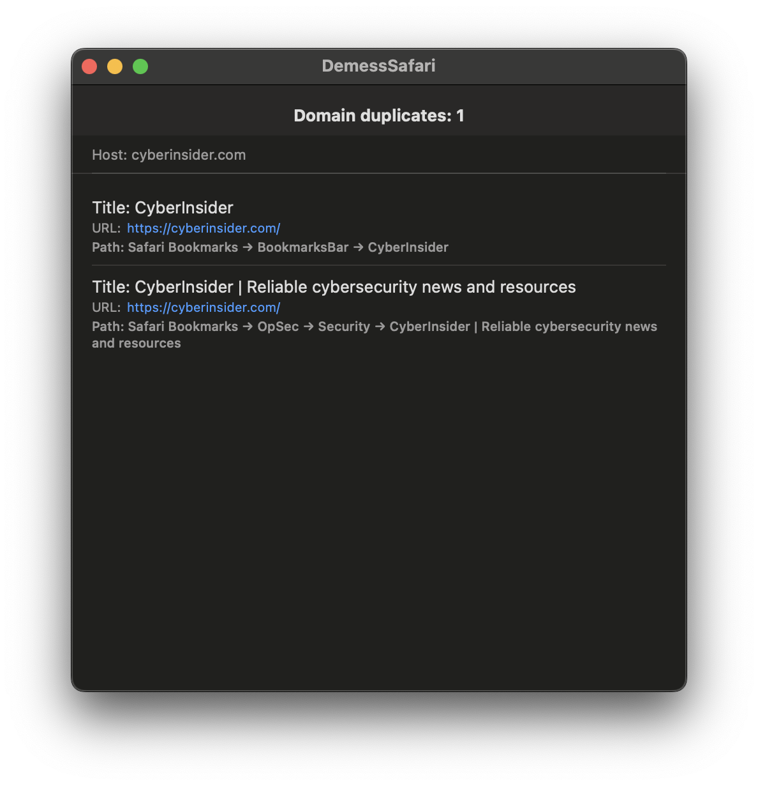

# DemessSafari

Safari bookmark‑management system is notoriously clunky, and I had to suffer so much just to find duplicate bookmarks. To make this easier, I vibed a simple app that highlights duplicates for you.

## Build & run

1. Clone the repository
2. Open it in Xcode and press `⌘R` (Run)

Note: Because of Apple’s paywall I’m not able to distribute the binary (and I’d rather not spend $100 / month on a developer license). If you try to run an unsigned build, you’ll get a key‑verification error.

The app is built with SwiftUI and targets macOS 12.4 or later.

## How to use?

1. Launch the app
2. In the file picker that appears automatically, choose `Bookmarks.plist`
   If you can’t locate it automatically, navigate manually to:
   `/Users/<your_user>/Library/Safari/`
3. Once a file is selected, any duplicate bookmark entries will be highlighted.

